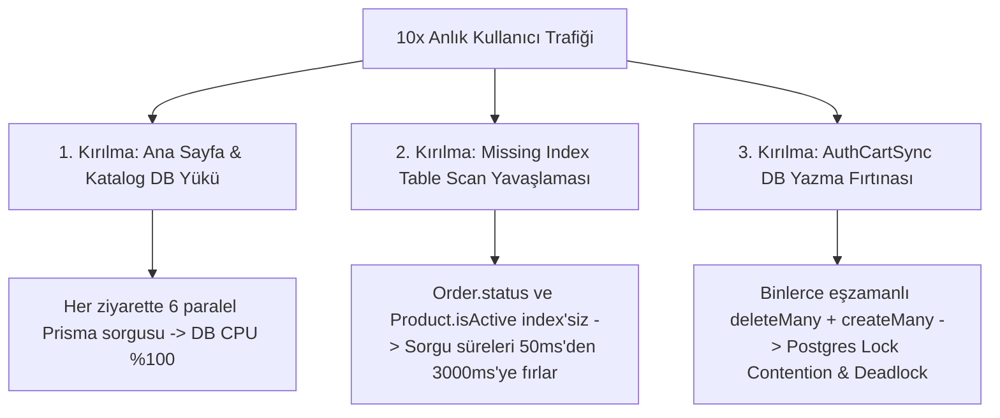
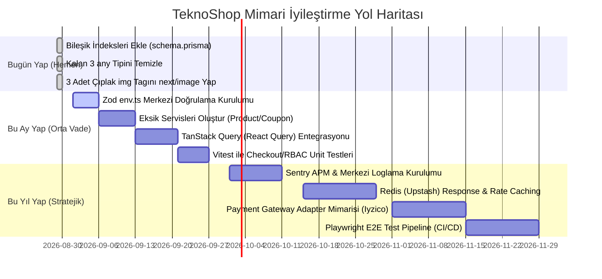

# 🏗️ TeknoShop — Derinlemesine Sistem Mimarisi Sağlık Raporu

> **Denetim Türü:** Whole-System Architecture & Scalability Health Audit (Phase 17 — Read-Only)  
> **Tarih:** 2026-08-29  
> **Denetçi:** Antigravity (Lead Software & Cloud Architect AI)  
> **Kapsam:** 8 Temel Mimari Boyut — Katmanlama, Veri Modeli, State Yönetimi, Rendering/Performans, Entegrasyonlar, Gözlemlenebilirlik, Test/Kalite, Ölçeklenebilirlik  
> **Önceki Denetimler:** `docs/architecture-audit-report.md` (Auth/UI Kök Neden) ve `docs/feature-gap-report.md` (Eksik Özellik) raporlarındaki bulgularla çakışmayan, sistemin bütünsel mimari sağlığına odaklanılmıştır.

---

## 1. Yönetici Özeti (Executive Summary)

TeknoShop; modern Next.js 15, Prisma ORM, TypeScript Strict Mode ve TailwindCSS üzerine inşa edilmiş, temiz yazım standartlarına sahip güçlü bir e-ticaret platformudur. Kritik iş süreçlerinde (iade, değişim, checkout ve adres yönetimi) servis katmanı ve ACID transaction güvencesi başarılı bir şekilde kurgulanmıştır. Ancak katalog, kategori, marka, sepet ve kupon gibi çekirdek domainlerde servis katmanının bulunmaması, veritabanı şemasındaki eksik indeksler (status, createdAt, price, isActive) ve istemci tarafında merkezi bir veri önbellekleme (React Query/SWR) altyapısının eksikliği, sistemin 10x trafik altında ölçeklenmesini zorlaştıran temel mimari risklerdir.

---

## 2. Mimari Olgunluk Skor Kartı (Scorecard)

| Boyut | Puan (1-10) | Durum | Temel Gerekçe |
|---|:---:|:---:|---|
| **Boyut 1: Katmanlama & Sorumluluk Ayrımı** | **6.5 / 10** | 🟡 Orta | İade/değişim/checkout servisleri çok güçlü; ancak katalog, sepet, kupon ve kategori domainlerinde servis katmanı yok (87+ doğrudan Prisma çağrısı API rotalarında). |
| **Boyut 2: Veri Modeli & Şema Sağlığı** | **7.0 / 10** | 🟡 Orta | İlişki kurguları ve UUID primary key'ler temiz; ancak sık filtrelenen/sıralanan `Product.isActive`, `Product.price`, `Order.status`, `Order.createdAt` kolonlarında index eksik. `ExchangeStatus` enum tipi yerine string karşılaştırması yapılmış. |
| **Boyut 3: State Management Mimarisi** | **6.0 / 10** | 🟡 Orta | Zustand localStorage persist yapısı çalışıyor; ancak React Query/SWR gibi bir server-state cache katmanı yok, 39+ farklı component kendi `useEffect+fetch` mantığını yürütüyor (çift profil/ayarlar isteği). |
| **Boyut 4: Rendering & Performans** | **7.0 / 10** | 🟡 Orta | `next/image` %95 oranında benimsenmiş (sadece 3 adet çıplak ``); ancak 85+ dosyada `"use client"` var ve sunucu önbelleklemesi (`unstable_cache`) bulunmuyor. |
| **Boyut 5: Entegrasyon & 3. Parti Mimarisi** | **6.5 / 10** | 🟡 Orta | Resend e-posta servisi fallback'li; ancak ödeme ve depolama için provider adapter interface'i (Port/Adapter) yok, env değişkenleri için Zod build-time validation şeması bulunmuyor. |
| **Boyut 6: Hata Yönetimi & Gözlemlenebilirlik** | **6.5 / 10** | 🟡 Orta | AuditLogService 44 farklı admin aksiyonunu başarıyla logluyor (harika); ancak merkezi Sentry/Pino logger yok, 164+ yerde çıplak `console.error` kullanılıyor ve API hata yanıtları standardize değil. |
| **Boyut 7: Test Edilebilirlik & Kod Kalitesi** | **6.0 / 10** | 🟡 Orta | TypeScript `strict: true` açık, tüm projede yalnızca 3 adet `any` tipi var (mükemmel tip güvenliği); ancak projede 0 adet otomatik test (Unit/E2E) bulunuyor. |
| **Boyut 8: Ölçeklenebilirlik & Deployment** | **6.0 / 10** | 🟡 Orta | Neon connection pooler aktif; ancak dinamik sayfalarda Redis/In-Memory response cache bulunmadığından kampanya anında tüm yük doğrudan veritabanına biniyor. |

### 🏆 Genel Mimari Olgunluk Skoru: **64.5 / 100**

> **Phase 15 (Auth Denetimi: 76/100) ile Karşılaştırma:**  
> Phase 15 denetimi dar bir kapsamda (Kimlik doğrulama, RBAC ve IDOR güvenlik katmanları) yapıldığı için 76 puan almıştı (güvenlik kalkanları oldukça sağlamdı). Phase 17'de ise sistemin **bütünsel yazılım mühendisliği altyapısı** (test eksikliği, servis katmanı asimetrisi, caching yokluğu, loglama ve şema optimizasyonları) değerlendirildiğinden genel olgunluk skoru **64.5 / 100** olarak tespit edilmiştir.

---

## 3. Boyut Bazlı Detaylı Bulgular

---

### BOYUT 1 — Katmanlama ve Sorumluluk Ayrımı (Layering)

#### Somut Kanıtlar & Sayılar:
- `lib/services/` altında **10 adet servis** bulunmaktadır (`address`, `admin-notification`, `audit-log`, `checkout`, `email`, `exchange`, `order`, `profile`, `return`, `user-notification`).
- Ancak **Product, Category, Brand, Coupon, Cart, Review, Search, StoreSettings** domainleri için hiçbir servis sınıfı/modülü bulunmamaktadır.
- `app/api/` altında **87+ doğrudan `prisma.*` çağrısı** mevcuttur. İş kuralları (fiyat hesaplama, kupon çoğaltma, stok azaltma, veri doğrulama) doğrudan Next.js `route.ts` API handler'ları içine gömülmüştür.
- Server Component sayfalarında (`page.tsx` ve `layout.tsx`) **110+ doğrudan `prisma.*` çağrısı** bulunmaktadır.

#### Neden Önemli?
İş mantığı API rotalarına veya sayfalara yazıldığında:
1. Aynı iş mantığı (örn. ürün filtreleme veya kupon doğrulama) başka bir Server Action veya API rotasında tekrar yazılarak DRY (Don't Repeat Yourself) ilkesi ihlal edilir.
2. İş kuralları Next.js HTTP request/response döngüsüne sıkı sıkıya bağlanır, bağımsız birim testleri (unit test) yazılamaz hale gelir.

#### Öneriler:
- **Kısa Vade:** `ProductService`, `CategoryService` ve `CouponService` oluşturularak API rotalarındaki Prisma sorguları bu servis fonksiyonlarına taşınmalıdır.
- **Orta Vade:** Server Component'lerin doğrudan Prisma yerine servis katmanını çağırması kuralı (Architecture Boundary Rule) benimsenmelidir.
- **Uzun Vade:** CQRS esintili repository/service ayrımı yapılarak okuma (query) ve yazma (command/mutation) operasyonları ayrıştırılmalıdır.

---

### BOYUT 2 — Veri Modeli ve Prisma Şema Sağlığı

#### Somut Kanıtlar & Sayılar:
1. **Eksik Kritik İndeksler:**
   - `Order` tablosunda yalnızca `@@index([userId])` vardır. Sık filtrelenen ve sıralanan `status`, `createdAt` kolonlarında indeks yoktur. Admin panelinde `where: { status: "PENDING" }, orderBy: { createdAt: "desc" }` sorguları full table scan yapar.
   - `Product` tablosunda `categoryId` ve `brandId` indekslidir; ancak vitrinde sürekli çalışan `where: { isActive: true }, orderBy: { price: "asc" }` ve `orderBy: { salesCount: "desc" }` için `isActive`, `price`, `salesCount` kolonlarında bileşik (composite) indeks bulunmamaktadır.
   - `User` tablosunda yalnızca email unique'tir; `role`, `isActive`, `createdAt` üzerinde indeks yoktur.
2. **Tip Güvenliğini Kıran String Karşılaştırması:**
   - [`app/(storefront)/profile/orders/[id]/page.tsx:121`](file:///c:/Users/Salih/Staj/Teknoshop/app/%28storefront%29/profile/orders/%5Bid%5D/page.tsx#L121) satırında:
     `["PENDING", "APPROVED", "SHIPPED_BY_CUSTOMER", "RECEIVED", "SHIPPED_BY_ADMIN"].includes(e.status)`
     yazılmıştır. Ancak `ExchangeStatus` enum'ında `SHIPPED_BY_CUSTOMER` veya `SHIPPED_BY_ADMIN` isimli değerler **mevcut değildir** (`WAITING_FOR_CUSTOMER`, `SHIPPED` vardır). String literal kullanıldığı için TypeScript derleyicisi bu mantık hatasını yakalayamamıştır.
3. **onDelete Davranışları:**
   - `Order -> User` ve `Product -> Category/Brand` ilişkilerinde `onDelete` davranışı belirtilmemiştir (Prisma varsayılanı `Restrict`). Bu veri bütünlüğü açısından güvenlidir (kullanıcı/kategori silinince sipariş/ürün havada kalmaz); ancak kod tarafında soft-delete (`isActive: false` / `isDeleted: true`) mekanizmasıyla tam olarak senkronize edilmelidir.

#### Öneriler:
- **Kısa Vade:** `schema.prisma`'ya eksik bileşik indeksler eklenmeli:
  - `Order`: `@@index([status, createdAt])`, `@@index([createdAt])`
  - `Product`: `@@index([isActive, createdAt])`, `@@index([isActive, price])`, `@@index([isActive, salesCount])`
  - `Coupon`: `@@index([isActive, expireDate])`
- **Kısa Vade:** `profile/orders/[id]/page.tsx` içindeki string literal durum dizisi merkezi `ExchangeStatus` enum tipine dönüştürülmelidir.
- **Orta Vade:** Tüm modellerde fiziksel silme (`DELETE`) yerine Soft-Delete (`deletedAt DateTime?`) standardı getirilmelidir.

---

### BOYUT 3 — State Management Mimarisi (Zustand + Server State)

#### Somut Kanıtlar & Sayılar:
- Zustand (`lib/store.ts`) sepeti `localStorage` üzerinde `cart-storage` anahtarıyla tutmaktadır.
- Sepet hem istemci tarafında (Zustand) hem de veritabanında (`Cart` & `CartItem` modelleri) çift kaynaklıdır (Dual Source of Truth). Senkronizasyon `components/AuthCartSync.tsx` üzerinden yürütülmektedir.
- Projede React Query (`@tanstack/react-query`) veya `swr` kütüphanesi **yoktur**.
- **39+ farklı component** kendi bağımsız `useEffect` + `fetch()` çağrısını yapmaktadır.
  - Örnek: `Navbar.tsx:44` ve `AccountPopover.tsx:32` aynı sayfa açıldığında `/api/profile` endpoint'ine **birbirinden habersiz 2 ayrı eşzamanlı istek** göndermektedir.
  - Benzer şekilde `/api/settings` endpoint'i `cart/page.tsx`, `checkout/page.tsx`, `OrderInvoiceModal.tsx` ve `StoreSettingsClient.tsx` tarafından ayrı ayrı `fetch` edilmektedir.
- Zustand store'unda şema versiyonlama (`version` ve `migrate` middleware) kullanılmamaktadır. `CartItem` arayüzüne yeni zorunlu alanlar eklendiğinde eski tarayıcı verileri bozulma riski taşır (`safeStorage` içindeki try-catch bunu yalnızca resetleyerek çözmektedir).

#### Öneriler:
- **Kısa Vade:** `Navbar` ve `AccountPopover` gibi paylaşılan kullanıcı verisi için tek bir UserContext / Store veya prop drill yapısı kurulmalıdır.
- **Orta Vade:** TanStack Query (React Query) entegre edilerek istemci tarafındaki tüm GET API istekleri önbelleklenmeli (stale-while-revalidate), otomatik deduplication ve optimistic update sağlanmalıdır.
- **Orta Vade:** Zustand `persist` middleware'ine `version: 1` ve migration handler eklenmelidir.

---

### BOYUT 4 — Rendering ve Performans Mimarisi

#### Somut Kanıtlar & Sayılar:
- Projedeki component ve sayfalardan **85+ adedinde `"use client"` direktifi** bulunmaktadır.
- Bazı saf sunum bileşenlerinde (örn. `ProfileStats.tsx`, `OrderProgressBar.tsx`) hiçbir hook (`useState`, `useEffect`) veya tarayıcı API'si kullanılmamasına rağmen `"use client"` tanımlıdır.
- `next/image` (`<Image />`) bileşeni projenin %95'inde doğru benimsenmiştir. Yalnızca **3 adet çıplak `` etiketi** tespit edilmiştir:
  1. `components/admin/users/CustomerProfileClient.tsx:115`
  2. `components/admin/users/CustomerDetailDrawer.tsx:62`
  3. `components/admin/users/AdminUsersClient.tsx:372`
- Büyük listeleme sayfalarında (vitrin katalog, arama, admin ürünler, admin kullanıcılar) sayfalama stratejisi tutarsızdır: Vitrin sayfalarında URL query tabanlı pagination bileşeni varken, admin sayfalarında `take: 300` hard limit kullanılmıştır.

#### Öneriler:
- **Kısa Vade:** 3 adet çıplak `` etiketi `next/image` bileşenine dönüştürülmelidir.
- **Kısa Vade:** Saf prop render eden sunum bileşenlerindeki `"use client"` direktifleri kaldırılarak Server Component yapılmalıdır.
- **Orta Vade:** Next.js 15 `unstable_cache` API'si kullanılarak ana sayfa vitrin sorguları (Kategoriler, Markalar, Öne Çıkan Ürünler) 60 saniyelik ISR/Cache ile korunmalıdır.

---

### BOYUT 5 — Entegrasyon ve Üçüncü Parti Bağımlılık Mimarisi

#### Somut Kanıtlar & Sayılar:
- **E-posta Servisi:** `lib/email-service.ts` Resend REST API ile çalışmakta ve API key yoksa console fallback ile sessizce devam etmektedir (başarılı tasarım).
- **Ödeme Servisi:** `package.json`'da `iyzipay` paketi bulunmakla birlikte, ödeme akışı `lib/services/checkout.service.ts` içinde simüle edilmektedir. Çoklu sağlayıcı (Iyzico, PayTR, Stripe) için ortak bir `IPaymentGatewayAdapter` arayüzü kurgulanmamıştır.
- **Dosya Yükleme:** UploadThing entegrasyonu doğrudan Next.js router'ına bağlıdır; genel bir `StorageProvider` (S3, MinIO, Cloudinary) arkasında soyutlanmamıştır.
- **Environment Variables:** `process.env.*` çağrıları **10+ farklı dosyaya** dağılmıştır (`lib/rate-limiter.ts`, `lib/email-service.ts`, `app/sitemap.ts`, `app/robots.ts`, `components/admin/orders/OrderInvoiceModal.tsx` vb.). Merkezi bir `env.ts` (Zod validation) **yoktur**.

#### Neden Önemli?
`NEXT_PUBLIC_CLERK_PUBLISHABLE_KEY` veya `DATABASE_URL` gibi kritik bir değişken eksik olduğunda build anında hata verilmez; uygulama deploy edilir ve runtime anında ilk kullanıcı isteğinde çöker.

#### Öneriler:
- **Kısa Vade:** `@t3-oss/env-nextjs` veya Zod ile `lib/env.ts` dosyası oluşturulmalı; tüm ortam değişkenleri build anında tip güvenliğiyle doğrulanmalıdır.
- **Orta Vade:** `PaymentAdapter` interface'i tanımlanarak Iyzico/Stripe entegrasyonları bu interface arkasında plugin mimarisiyle yazılmalıdır.

---

### BOYUT 6 — Hata Yönetimi ve Gözlemlenebilirlik (Observability)

#### Somut Kanıtlar & Sayılar:
- **Yapılandırılmamış Loglama:** Proje genelinde **164+ adet `console.error`** çağrısı bulunmaktadır. Sentry, Logtail, Datadog veya Pino gibi merkezi bir APM / Error Tracking sistemi entegre değildir.
- **API Yanıt Standardı:** API rotalarında hata yanıtları tutarsızdır:
  - Bazı rotalar `{ error: "Mesaj" }`
  - Bazıları `{ error: "Mesaj", details: ... }`
  - Bazıları `{ success: false, error: "Mesaj" }`
  - Bazıları `{ error: "Mesaj", retryAfterSeconds: ... }`
- **Audit Log Kapsamı (Güçlü Yön):** `AuditLogService.createAuditLog` projenin **44 farklı kritik noktasında** (ürün oluşturma/güncelleme/silme, kategori/marka yönetimi, kupon işlemleri, rol atama, sipariş kargo/durum güncelleme, mağaza ayarları, iade/değişim onayları) tutarlı ve yüksek disiplinle kullanılmaktadır.

#### Öneriler:
- **Kısa Vade:** Merkezi bir `ApiResponse` yardımcı fonksiyonu (`lib/api-response.ts`) yazılarak tüm API endpoint'lerinin `{ success: boolean, data?: T, error?: string, errorCode?: string }` formatında dönmesi sağlanmalıdır.
- **Orta Vade:** Sentry SDK (`@sentry/nextjs`) entegre edilerek hem istemci hem sunucu hataları alert mekanizmasına bağlanmalıdır.
- **Orta Vade:** Gelen her HTTP isteğine `x-request-id` header'ı atanarak audit logları ve hata logları birbiriyle ilişkilendirilmelidir (Traceability).

---

### BOYUT 7 — Test Edilebilirlik ve Kod Kalitesi Altyapısı

#### Somut Kanıtlar & Sayılar:
- **Otomatik Testler:** Projede **0 adet test dosyası** bulunmaktadır (`__tests__`, `*.test.ts`, `*.spec.ts` bulunamadı). Jest, Vitest veya Playwright kurulu değildir.
- **Tip Güvenliği (Mükemmel Seviye):**
  - `tsconfig.json` dosyasında `"strict": true` açıktır.
  - Proje genelinde yapılan taramada **yalnızca 3 adet `any` tipi** tespit edilmiştir (`search/page.tsx:67`, `search/page.tsx:103`, `app/(storefront)/page.tsx:70`).
- **İş Mantığı Test Edilebilirliği:** `CheckoutService.processOrder`, `ReturnService`, `ExchangeService` ve `rbac.ts` saf iş kuralları içermekte olup dependency injection (mock Prisma client) ile kolayca unit test yazılabilir mimaridedir.

#### Öneriler:
- **Kısa Vade:** Kalan 3 adet `any` tipi Prisma'nın `Prisma.ProductWhereInput` ve `Prisma.ProductOrderByWithRelationInput` tipleriyle değiştirilerek tam `%100 Any-Free` seviyesine ulaşılmalıdır.
- **Orta Vade:** `Vitest` kurularak en kritik iş mantıkları için unit test suite'i yazılmalıdır (`checkout.service.test.ts`, `rbac.test.ts`, `loyalty-engine.test.ts`).
- **Uzun Vade:** Playwright ile temel checkout ve sipariş akışını doğrulayan E2E smoke test pipeline'ı (GitHub Actions) kurulmalıdır.

---

### BOYUT 8 — Ölçeklenebilirlik ve Deployment Mimarisi

#### Somut Kanıtlar & Sayılar:
- **Serverless In-Memory Durum:** `lib/rate-limiter.ts` içinde process belleğinde tutulan `memoryCache = new Map<string, MemoryBucket>()` bulunmaktadır. Upstash Redis değişkenleri tanımlanmadığı sürece çoklu instance (Vercel Lambdas) ortamında rate limit instance'lar arasında paylaşılamaz.
- **Bağlantı Havuzu:** Neon PostgreSQL Connection Pooler (`ep-delicate-hat-asph4gow-pooler...`) kullanılmaktadır; bu sayede serverless fonksiyonların Postgres bağlantı sınırını tüketmesi önlenmektedir.
- **Server Cache Eksikliği:** Vitrin sayfaları (`/`, `/products`, `/categories`) tamamen dinamik (`force-dynamic` veya dynamic fetch) olarak render edilmekte, Prisma seviyesinde veya Next.js data cache seviyesinde caching bulunmamaktadır.

---

## 4. "1 Yıl Sonra 10x Kullanıcı / Kampanya Gününde Nerede Kırılır?"

Sistem bugünkü mimarisiyle 10 katı anlık kullanıcı trafiğine (örn. Black Friday / Gece Yarısı İndirimi) maruz kaldığında kırılacak ilk 3 nokta:

1. **1. Kırılma Noktası — Ana Sayfa & Katalog Veritabanı Darboğazı:**  
   Ana sayfayı (`/`) ziyaret eden her kullanıcı için 6 farklı ağır Prisma sorgusu (Kategoriler, Çok Satanlar, Kişiselleştirilmiş Öneriler, Flaş Ürünler, Değerlendirmeler) çalışmaktadır. 5.000 anlık kullanıcı = saniyede 30.000 veritabanı sorgusu demektir. Response cache (Redis / Next.js Data Cache) olmadığı için Neon PostgreSQL veritabanı CPU limiti tükenecek ve `504 Gateway Timeout` hataları başlayacaktır.

2. **2. Kırılma Noktası — İndekssiz Tablolarda Full Table Scan Kilitlenmesi:**  
   Sipariş sayısı 100.000'i aştığında, `Order.status` ve `Order.createdAt` kolonlarında indeks bulunmadığı için admin panelindeki sipariş filtrelemeleri ve istatistik sorguları tablonun tamamını tarayacak, sorgu süreleri 50ms'den 3-5 saniyeye fırlayarak veritabanı bağlantı havuzunu (pooler) kilitleyecektir.

3. **3. Kırılma Noktası — AuthCartSync Sepet Yazma Fırtınası (Lock Contention):**  
   Binlerce oturum açmış kullanıcı kampanya anında sayfaları gezerken, `AuthCartSync` bileşeni her focus ve hard-refresh'te `/api/cart` endpoint'ine `POST` isteği gönderecektir. `prisma.cartItem.deleteMany` + `prisma.cartItem.createMany` transaction'ları PostgreSQL üzerinde yoğun satır kilitleme (Row-Level Locking) ve potansiyel Deadlock yaratarak sepet işlemlerini çökertecektir.

---

## 5. Eylem Planı: Bugün / Bu Ay / Bu Yıl

### 🔴 1. Bugün Yap (Hemen — Düşük Efor / Yüksek Etki)
1. **Şemaya İndeks Ekle:** `Order(status, createdAt)`, `Product(isActive, price)`, `Product(isActive, salesCount)` indekslerini ekleyip migration çalıştır.
2. **Kalan 3 `any` Tipini Temizle:** `search/page.tsx` ve `app/(storefront)/page.tsx` dosyalarındaki `any` tiplerini Prisma modelleriyle değiştir.
3. **Çıplak `` Etiketlerini Değiştir:** `CustomerProfileClient.tsx`, `CustomerDetailDrawer.tsx` ve `AdminUsersClient.tsx` içindeki 3 adet `` etiketini `<Image />` bileşenine dönüştür.

### 🟡 2. Bu Ay Yap (Orta Vade — Mimari Temeller)
1. **Merkezi `env.ts` Kurulumu:** Zod ile tüm ortam değişkenlerini build anında doğrulayan şemayı oluştur.
2. **Eksik Domain Servislerini Oluştur:** `ProductService`, `CategoryService`, `CouponService`, `CartService` dosyalarını yazıp API rotalarındaki iş mantığını servis katmanına taşı.
3. **TanStack Query Entegrasyonu:** Tekrarlayan `useEffect+fetch` çağrılarını kaldırıp `useQuery` ile istemci tarafı caching ve deduplication sağla.
4. **Unit Test Altyapısı:** `Vitest` kurarak `checkout.service.ts`, `return.service.ts` ve `rbac.ts` için unit test yaz.

### 🟢 3. Bu Yıl Yap (Stratejik — 10x Ölçeklenebilirlik)
1. **Merkezi Hata Takibi (Sentry):** Production runtime hata ve performans takibini devreye al.
2. **Distributed Response Caching (Upstash Redis):** Ana sayfa vitrin verilerini ve rate limit state'ini Redis üzerine taşı.
3. **Unified Payment Gateway Adapter:** Gerçek Iyzico / Stripe entegrasyonunu Provider Pattern ile soyutla.
4. **CI/CD E2E Smoke Tests:** Playwright ile otomatik PR kontrol pipeline'ı kur.

---

## 6. Sonuç

TeknoShop'un mevcut mimarisi; tip güvenliği, RBAC kurgusu, ACID veri bütünlüğü ve denetim izi (audit log) açılarından oldukça yüksek standartlara sahiptir. Tespit edilen eksiklikler sistemin hatalı kodlanmasından değil, **hızlı geliştirme sürecinde servis katmanı soyutlamalarının ve caching altyapısının ikinci plana atılmasından** kaynaklanmaktadır. Bu raporda sunulan indeksleme, servis katmanı tamamlama ve client-side caching adımları uygulandığında TeknoShop, kurumsal ölçekte yüksek trafikli bir e-ticaret platformuna sorunsuzca dönüşecektir.
